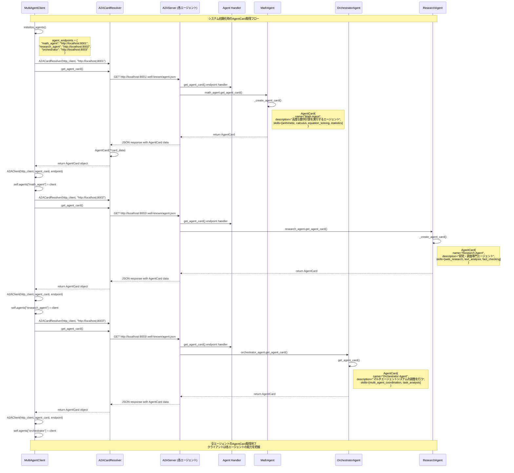

# AgentCard の受け渡しフロー

A2A Multi-Agent SystemにおけるAgentCardの受け渡しは、エージェントの能力発見と通信確立において重要な役割を果たします。

## AgentCard とは

AgentCardは各エージェントの能力、スキル、エンドポイント情報を含むメタデータです。

```python
class AgentCard(BaseModel):
    name: str                                    # エージェント名
    description: str                             # 説明
    version: str = "1.0.0"                      # バージョン
    skills: List[AgentSkill] = []               # スキル一覧
    supportsAuthenticatedExtendedCard: bool = True  # 拡張カード対応
    endpoint: Optional[str] = None              # エンドポイントURL
```

## AgentCard の受け渡しフロー



## 詳細な実装

### 1. エージェント側でのAgentCard作成

**Math Agent の例:**
```python
# src/agents/math_agent.py
def _create_agent_card(self) -> AgentCard:
    """エージェントカードを作成"""
    return AgentCard(
        name="Math Agent",
        description="高度な数学計算を実行するエージェント",
        version="1.0.0",
        skills=[
            AgentSkill(
                name="arithmetic",
                description="基本的な算術演算",
                examples=["2 + 2", "15 * 7", "100 / 4"],
                tags=["math", "basic", "calculator"]
            ),
            AgentSkill(
                name="calculus",
                description="微分と積分",
                examples=["x^2の微分", "sin(x)の積分"],
                tags=["calculus", "derivatives", "integrals"]
            ),
            # ... 他のスキル
        ],
        supportsAuthenticatedExtendedCard=True
    )
```

### 2. サーバー側でのAgentCard公開

**A2AServer での実装:**
```python
# src/a2a/server.py
@app.get("/.well-known/agent.json")
async def get_agent_card() -> Dict[str, Any]:
    """公開エージェントカードを返す"""
    return self.agent_card.model_dump(exclude_none=True)

@app.get("/agent/authenticatedExtendedCard")
async def get_extended_agent_card() -> Dict[str, Any]:
    """認証済み拡張エージェントカードを返す"""
    # 実際の実装では認証チェックを行う
    return self.agent_card.model_dump(exclude_none=True)
```

### 3. クライアント側でのAgentCard取得

**A2ACardResolver の実装:**
```python
# src/a2a/protocol.py
class A2ACardResolver:
    async def get_agent_card(
        self,
        relative_card_path: str = "/.well-known/agent.json",
        http_kwargs: Optional[Dict[str, Any]] = None
    ) -> AgentCard:
        """エージェントカードを取得"""
        url = f"{self.base_url}{relative_card_path}"
        kwargs = http_kwargs or {}
        
        try:
            response = await self.client.get(url, **kwargs)
            response.raise_for_status()
            card_data = response.json()
            return AgentCard(**card_data)
        except Exception as e:
            logger.error(f"Failed to fetch agent card from {url}: {e}")
            raise
```

### 4. A2AClient でのAgentCard利用

```python
# src/a2a/protocol.py
class A2AClient:
    def __init__(self, httpx_client: httpx.AsyncClient, agent_card: AgentCard, base_url: str = ""):
        self.client = httpx_client
        self.agent_card = agent_card  # AgentCardを保持
        self.base_url = base_url or agent_card.endpoint or ""
    
    async def send_message(self, request: SendMessageRequest) -> SendMessageResponse:
        """メッセージを送信（AgentCardの情報を使用してエンドポイントを決定）"""
        url = f"{self.base_url}/a2a/sendMessage"
        # ... メッセージ送信処理
```

## AgentCard の重要な役割

### 1. **エージェント発見 (Agent Discovery)**
- クライアントは各エージェントのエンドポイントに `/.well-known/agent.json` をリクエスト
- エージェントの能力、スキル、バージョン情報を取得

### 2. **能力マッチング (Capability Matching)**
- Orchestratorはタスクの性質に応じて適切なエージェントを選択
- AgentCardのskillsフィールドを参照して最適なエージェントを判断

### 3. **通信確立 (Communication Establishment)**
- AgentCardにはエンドポイント情報が含まれる
- A2AClientはこの情報を使用してメッセージの送信先を決定

### 4. **バージョン管理 (Version Management)**
- エージェントのバージョン情報を追跡
- 互換性の確認とアップグレード管理

## 現在の実装での注意点

### 1. **直接呼び出しの問題**
現在のOrchestratorは、実際のA2Aプロトコルを使用せず、直接math_agentを呼び出しています：

```python
# orchestrator.py の _call_math_agent メソッド
def _call_math_agent(self, user_input: str) -> str:
    # 直接インポートして呼び出し（A2Aプロトコルを経由しない）
    from .math_agent import math_agent
    # ...
```

### 2. **本来のA2Aフロー**
本来は以下のようなフローが想定されています：

```python
# 理想的な実装
async def _call_math_agent_via_a2a(self, user_input: str) -> str:
    # 1. AgentCardから適切なmath_agentクライアントを取得
    math_client = self.agent_clients.get("math_agent")
    
    # 2. A2Aプロトコルでメッセージを送信
    message = Message(role="user", parts=[MessagePart(kind="text", text=user_input)])
    request = SendMessageRequest(params=MessageSendParams(message=message))
    
    # 3. A2Aプロトコル経由でレスポンスを受信
    response = await math_client.send_message(request)
    return response.result.content
```

## まとめ

AgentCardは以下の流れで受け渡されます：

1. **起動時**: 各エージェントが自身のAgentCardを作成
2. **公開**: サーバーが `/.well-known/agent.json` エンドポイントで公開
3. **発見**: クライアントがA2ACardResolverを使用してAgentCardを取得
4. **保存**: A2AClientがAgentCardを保持し、通信に利用
5. **利用**: メッセージ送信時にAgentCardの情報（エンドポイントなど）を使用

この仕組みにより、動的なエージェント発見と能力ベースのタスク分散が可能になります。