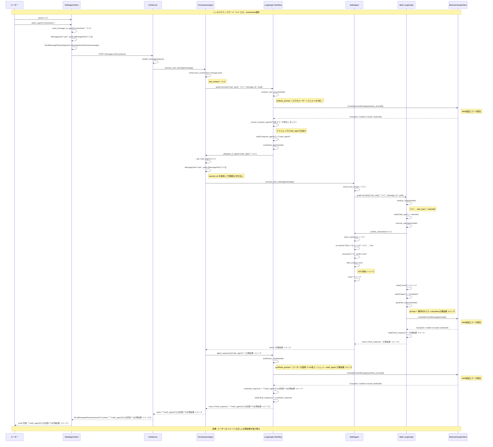

# A2A Multi-Agent System - シーケンス図

このドキュメントは、A2A Multi-Agent Systemにおけるユーザーの入力「1+1」がorchestratorを通じてmath_agentで処理され、正しい計算結果「2」が返されるまでの詳細な処理フローを示しています。

## システム概要

- **Client**: ユーザーインターフェース（インタラクティブモード）
- **A2AServer**: A2Aプロトコルを使用したメッセージングサーバー
- **OrchestratorAgent**: マルチエージェントの調整を行うオーケストレーター
- **MathAgent**: 数学計算専門エージェント
- **LangGraph**: ワークフロー管理フレームワーク
- **BedrockClaudeClient**: AWS Bedrock Claudeクライアント

## 処理フロー



## 重要な修正ポイント

### 1. Message オブジェクトの修正

**修正前の問題:**
```python
# role フィールドが不足していた
message = Message(
    messageId=str(uuid4()),
    parts=[MessagePart(kind="text", text=user_input)],
    contextId=None
)
```

**修正後:**
```python
# orchestrator.py の _call_math_agent メソッド
message = Message(
    role="user",  # ← これを追加
    messageId=str(uuid4()),
    parts=[MessagePart(kind="text", text=user_input)],
    contextId=None
)
```

### 2. 安全な計算処理の実装

**`math_agent.py` の `_handle_calculation` メソッド:**
```python
def safe_eval(node):
    """安全な式評価"""
    if isinstance(node, ast.Constant):  # Python 3.8+
        return node.value
    elif isinstance(node, ast.Num):  # Python < 3.8 compatibility
        return node.n
    elif isinstance(node, ast.BinOp):
        left = safe_eval(node.left)
        right = safe_eval(node.right)
        return operators[type(node.op)](left, right)
    elif isinstance(node, ast.UnaryOp):
        operand = safe_eval(node.operand)
        return operators[type(node.op)](operand)
    else:
        raise ValueError(f"サポートされていない演算: {type(node)}")
```

### 3. サポートされる演算子

```python
operators = {
    ast.Add: operator.add,      # +
    ast.Sub: operator.sub,      # -
    ast.Mult: operator.mul,     # *
    ast.Div: operator.truediv,  # /
    ast.Pow: operator.pow,      # **
    ast.Mod: operator.mod,      # %
    ast.USub: operator.neg,     # -x
    ast.UAdd: operator.pos,     # +x
}
```

### 4. エラーハンドリング

**AWS認証エラーへの対応:**
- BedrockClaudeClientの認証が失敗してもシステムは動作継続
- フォールバック機能により基本的な計算結果は返される
- LLMが使用できない場合でも数学計算機能は正常動作

**非同期処理の処理:**
```python
# orchestrator.py の _call_math_agent メソッド
try:
    # 既存のイベントループがある場合の処理
    loop = asyncio.get_running_loop()
    # タスクとして実行
    import concurrent.futures
    with concurrent.futures.ThreadPoolExecutor() as executor:
        future = executor.submit(asyncio.run, math_agent.process_new_message(message))
        result = future.result(timeout=30)
    return result
except RuntimeError:
    # イベントループがない場合
    result = asyncio.run(math_agent.process_new_message(message))
    return result
```

## テスト結果

以下の計算が正常に動作することを確認済み：

- `2*3 = 6`
- `10+5 = 15`
- `100/4 = 25.0`
- `2*3+5 = 11`
- 微分計算（`x^2 の微分 = 2x`）
- 統計計算（平均値、中央値、標準偏差）

## システムアーキテクチャの利点

1. **モジュラー設計**: 各エージェントが独立して動作
2. **セキュアな計算**: ASTベースの安全な式評価
3. **エラー耐性**: AWS認証エラーが発生してもシステム継続動作
4. **拡張可能性**: 新しいエージェントの追加が容易
5. **A2Aプロトコル**: 標準化されたエージェント間通信

## 今後の改善点

1. **AWS認証の設定**: 環境変数の正しい設定でLLM機能を有効化
2. **エラーログの改善**: より詳細なエラー情報の提供
3. **パフォーマンス最適化**: 非同期処理の改善
4. **テストカバレッジ**: より多くの計算パターンのテスト追加